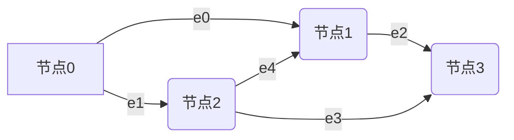

# 缩域

## 对问题重新描述

好的，下面给出离散形式与矩阵形式的完整描述，并明确采用关联矩阵以便用 PDHG 求解。为符合你的设定，使用同质成本，令 $p_{ke} \equiv p_e$，且 $p_e$ 可设为常量或统一向量。

---

### 一、离散形式（标量形式）

- 已知
  - 有向图 $G=(V,E)$，节点数 $N=|V|$，边数 $M=|E|$。
  - 链路容量向量 $c \in \mathbb{R}^M$, 每条边 $e$ 容量为 $c_e$。
  - 商品集合 $k=1,\dots,K$，每个商品的源汇与目标需求 $(s_k, t_k, d_k)$。
  - 同质运输成本：每条边的单位成本 $p_e$（可取常量 $\bar p$），不随商品变化。
  - 重要性权重 $w_k>0$。

- 变量
  - 商品 $k$ 在边 $e$ 上的流量 $x_{ke} \ge 0$。
  - 商品 $k$ 的总净流量 $X_k \ge 0$（从 $s_k$ 到 $t_k$）。

- 目标（最小化二次偏差惩罚 + 线性运输成本）

$$
\min_{x_{ke}\ge 0,\; X_k\ge 0}\;
\sum_{k=1}^K w_k (X_k - d_k)^2 + \sum_{e\in E} p_e \Big(\sum_{k=1}^K x_{ke}\Big)
$$

- 约束
  1) 每个商品的流量守恒（对每个节点 $v\in V$）：
  
$$
\sum_{e\text{ into }v} x_{ke} - \sum_{e\text{ out of }v} x_{ke} =
\begin{cases}
X_k & v=t_k\\
-X_k & v=s_k\\
0 & \text{otherwise}
\end{cases}
\quad \forall k
$$
  
  2) 链路容量（对每条边 $e$）：
  
$$
\sum_{k=1}^K x_{ke} \le c_e,\quad \forall e\in E
$$
  

---

### 二、矩阵形式（关联矩阵，适配 PDHG）

- 图关联矩阵
  - 令 $A\in \mathbb{R}^{N\times M}$ 为节点-边关联矩阵（选定方向约定：边 $e=(u\to v)$ 列在 $A$ 中取 $A_{u,e}=-1$, $A_{v,e}=+1$，其他为 $0$）。

- 堆叠变量
  - 将每个商品的边流量堆叠为 $x_k\in \mathbb{R}^M$，再堆叠为总体向量

$$
x := \begin{bmatrix}x_1\\ \vdots \\ x_K\end{bmatrix} \in \mathbb{R}^{KM}
$$
    
  - 将总净流量写为向量

$$
X := \begin{bmatrix}X_1\\ \vdots \\ X_K\end{bmatrix} \in \mathbb{R}^K
$$

- 供求模式向量
  - 对每个商品 $k$，定义节点向量 $f_k\in \mathbb{R}^N$：

$$
(f_k)_v = \begin{cases}
-1 & v=s_k\\
+1 & v=t_k\\
0 & \text{otherwise}
\end{cases}
$$
    
  - 组合成块矩阵（将 $f_k$ 放在第 $k$ 块）：

$$
S := \begin{bmatrix}
f_1 & 0   & \cdots & 0\\
0   & f_2 & \cdots & 0\\
\vdots & \vdots & \ddots & \vdots\\
0   & 0   & \cdots & f_K
\end{bmatrix} \in \mathbb{R}^{(KN)\times K}
$$
    
使得 $S X = [X_1 f_1;\; \dots;\; X_K f_K] \in \mathbb{R}^{KN}$。

- 线性算子（用于约束）
- 流量守恒的左侧算子（块对角）：

$$
\mathcal{A} := I_K \otimes A \in \mathbb{R}^{(KN)\times (KM)}
$$

满足 $\mathcal{A} x = [A x_1;\; \dots;\; A x_K]$。

- 容量聚合算子（对商品求和到边）：

$$
\mathcal{C} := \mathbf{1}_K^\top \otimes I_M \in \mathbb{R}^{M\times (KM)}
$$

满足 $\mathcal{C} x = \sum_{k=1}^K x_k \in \mathbb{R}^M$。

- 成本向量
  - 边成本堆叠到 $KM$ 维：

$$
\tilde p := \mathbf{1}_K \otimes p \in \mathbb{R}^{KM}
$$
    
其中 $p\in \mathbb{R}^M$（可取常量向量 $p=\bar p\, \mathbf{1}_M$）。

- 权重矩阵
  - $W := \mathrm{diag}(w_1,\dots,w_K) \in \mathbb{R}^{K\times K}$。

- 矩阵优化模型（凸二次规划）

$$
\begin{aligned}
\min_{x\ge 0,\; X\ge 0}\quad &
(X - d)^\top W (X - d) \;+\; \tilde p^\top x\\
\text{s.t.}\quad &
\mathcal{A} x - S X = 0 \quad (\text{每商品的流量守恒})\\
& \mathcal{C} x \le c \quad (\text{边容量约束})
\end{aligned}
$$

- 说明
  - 若采用等价的最大化效用形式，可写为最大化 $-\,(X-d)^\top W (X-d) - \tilde p^\top x$，约束不变。
  - 非负约束 $x\ge 0,\; X\ge 0$ 可作为显式约束或通过指示函数纳入目标的可分项。

---

### 三、PDHG 友好表示（算子-指示函数分解）

为了使用 PDHG（Primal-Dual Hybrid Gradient），可将约束以指示函数的方式并入，从而构造成

- 原始变量：$z := (x, X)$
- 目标的可分解部分：
  - 可微/易近似的凸项：$f(z) := (X-d)^\top W (X-d) + \tilde p^\top x + I_{\{x\ge 0\}}(x) + I_{\{X\ge 0\}}(X)$
  - 线性算子与不可微项：$g(y) := I_{\{0\}}(y_2) + I_{\{y_1 \le c\}}(y_1)$

- 线性算子与“观测”堆叠

$$
\begin{aligned}
y_1 &= \mathcal{C} x \in \mathbb{R}^M\\
y_2 &= \mathcal{A} x - S X \in \mathbb{R}^{KN}
\end{aligned}
$$
  
  
  堆叠为 $y := \begin{bmatrix}y_1\\ y_2\end{bmatrix}$，并定义整体算子
  
$$
K := \begin{bmatrix}
\mathcal{C} & 0\\
\mathcal{A} & -S
\end{bmatrix},\quad
K z = \begin{bmatrix}
\mathcal{C} x\\
\mathcal{A} x - S X
\end{bmatrix}
$$

- 于是 PDHG 标准形式为

$$
\min_{z} \; f(z) + g(K z)
$$

  其中
  - $I_{\{0\}}(y_2)$ 是等式约束的指示函数（投影即强制为零）。
  - $I_{\{y_1 \le c\}}(y_1)$ 是容量不等式的指示函数（投影到盒集 $\{y_1\mid y_1\le c\}$）。
  - 非负约束通过对 $x$、$X$ 的投影到非负正交锥实现。

- 近端/投影操作（用于实现）
  - 对 $X$ 的近端：$\mathrm{prox}_{\tau (X-d)^\top W (X-d)}(X) = (I + 2\tau W)^{-1}(X + 2\tau W d)$（逐坐标，因 $W$ 对角）。
  - 对 $x$ 的线性项近端：$\mathrm{prox}_{\tau \tilde p^\top x}(x) = x - \tau \tilde p$，再与非负约束投影合并为 $\max\{0, x - \tau \tilde p\}$。
  - 对 $y_2$ 的指示函数：投影为 $y_2 \mapsto 0$。
  - 对 $y_1$ 的盒约束：投影为 $y_1 \mapsto \min\{y_1,\, c\}$（逐坐标）。

---

## 问题实例

请使用一个小规模（4个点5条边 如下所描述），我仅仅给你网络描述和容量向量，其他参数你自己生成，给我来解释上面的离散形式和矩阵形式

网络结构



容量向量：

```txt
c = [ 10, 8, 12, 7, 5 ]
      e0  e1  e2  e3  e4
```

### 0. 生成补充参数

为了构建完整的模型，我们需要先设定好你没有提供的参数：

*   **商品 (Commodities)**: 设定 $K=2$ 种商品。
    *   **商品1**: 从节点0运到节点3。我们希望运送量为 $d_1 = 15$。这是我们的高优先级货物，权重设为 $w_1 = 10$。
        *   $s_1=0, t_1=3, d_1=15, w_1=10$
    *   **商品2**: 从节点0运到节点1。我们希望运送量为 $d_2 = 6$。这是我们的低优先级货物，权重设为 $w_2 = 1$。
        *   $s_2=0, t_2=1, d_2=6, w_2=1$
*   **运输成本 (Cost)**: 设每条边的单位运输成本都是一个常量，比如 $p_e=0.5$。
*   **网络参数**: 已知 $N=4$ 个节点, $M=5$ 条边。
    *   $c = [10, 8, 12, 7, 5]^\top$

---

### 一、离散形式的实例化

基于以上参数，我们将抽象的数学公式替换为具体的数字和变量。

**变量**:

*   商品1的流量: $x_{10}, x_{11}, x_{12}, x_{13}, x_{14}$
*   商品2的流量: $x_{20}, x_{21}, x_{22}, x_{23}, x_{24}$
*   商品1和2的总流量: $X_1, X_2$

**目标函数 (Minimize)**:

$$
\underbrace{10 \cdot (X_1 - 15)^2 + 1 \cdot (X_2 - 6)^2}_{\text{偏离目标的惩罚}}
+
\underbrace{0.5 \sum_{e=0}^4 \sum_{k=1}^2 x_{ke}}_{\text{总运输成本}}
$$

展开运输成本项为:

$0.5(x_{10}+x_{20}) + 0.5(x_{11}+x_{21}) + 0.5(x_{12}+x_{22}) + 0.5(x_{13}+x_{23}) + 0.5(x_{14}+x_{24})$

**约束条件**:

1.  **流量守恒**:
    *   **对于商品1 ($s_1=0, t_1=3$)**:
        *   节点0: $(0) - (x_{10} + x_{11}) = -X_1$
        *   节点1: $(x_{10} + x_{14}) - (x_{12}) = 0$
        *   节点2: $(x_{11}) - (x_{13} + x_{14}) = 0$
        *   节点3: $(x_{12} + x_{13}) - (0) = X_1$
    *   **对于商品2 ($s_2=0, t_2=1$)**:
        *   节点0: $(0) - (x_{20} + x_{21}) = -X_2$
        *   节点1: $(x_{20} + x_{24}) - (x_{22}) = X_2$
        *   节点2: $(x_{21}) - (x_{23} + x_{24}) = 0$
        *   节点3: $(x_{22} + x_{23}) - (0) = 0$

2.  **链路容量**:
    *   边 e0: $x_{10} + x_{20} \le 10$
    *   边 e1: $x_{11} + x_{21} \le 8$
    *   边 e2: $x_{12} + x_{22} \le 12$
    *   边 e3: $x_{13} + x_{23} \le 7$
    *   边 e4: $x_{14} + x_{24} \le 5$

3.  **非负约束**:
    *   $x_{ke} \ge 0$ 对所有 $k,e$ 成立。
    *   $X_k \ge 0$ 对所有 $k$ 成立。

---

### 二、矩阵形式的实例化

现在，我们把上述离散形式 "翻译" 成矩阵和向量。

**1. 基本向量和矩阵**

*   **变量向量**:

$$
x = [x_{10}, x_{11}, x_{12}, x_{13}, x_{14}, x_{20}, x_{21}, x_{22}, x_{23}, x_{24}]^\top \in \mathbb{R}^{10} \\
X = [X_1, X_2]^\top \in \mathbb{R}^{2}
$$

*   **目标/容量/成本/权重**:


$$
d = [15, 6]^\top \\
c = [10, 8, 12, 7, 5]^\top \\
p = [0.5, 0.5, 0.5, 0.5, 0.5]^\top, \quad \tilde{p} = [p^\top, p^\top]^\top \in \mathbb{R}^{10} \\
W = \begin{bmatrix} 10 & 0 \\ 0 & 1 \end{bmatrix}
$$

**2. 核心算子矩阵**

*   **节点-边关联矩阵 $A \in \mathbb{R}^{4 \times 5}$**: 描述网络拓扑。
    行代表节点 (0,1,2,3)，列代表边 (e0,e1,e2,e3,e4)。
    
$$
\begin{array}{c|ccccc}
    & e_0 & e_1 & e_2 & e_3 & e_4 \\
\hline
v_0 & -1 & -1 &  0 &  0 &  0 \\
v_1 & +1 &  0 & -1 &  0 & +1 \\
v_2 &  0 & +1 &  0 & -1 & -1 \\
v_3 &  0 &  0 & +1 & +1 &  0
\end{array}
\quad\implies\quad
A = \begin{bmatrix}
-1 & -1 &  0 &  0 &  0 \\
+1 &  0 & -1 &  0 & +1 \\
    0 & +1 &  0 & -1 & -1 \\
    0 &  0 & +1 & +1 &  0
\end{bmatrix}
$$

*   **流量守恒算子 $\mathcal{A} = I_2 \otimes A \in \mathbb{R}^{8 \times 10}$**:

$$
\mathcal{A} = \begin{bmatrix} A & 0 \\ 0 & A \end{bmatrix} =
\begin{bmatrix}
-1 & -1 & 0 & 0 & 0 &  &  &  &  & \\
1 &  0 &-1 & 0 & 1 &  &  &  &  & \\
0 &  1 & 0 &-1 &-1 &  & \text{zeros} &  &  & \\
0 &  0 & 1 & 1 & 0 &  &  &  &  & \\
&  &  &  &  & -1 & -1 & 0 & 0 & 0 \\
& \text{zeros} & & & &  1 &  0 &-1 & 0 & 1 \\
&  &  &  &  &  0 &  1 & 0 &-1 &-1 \\
&  &  &  &  &  0 &  0 & 1 & 1 & 0
\end{bmatrix}
$$
    
*   **供求模式向量 $f_k \in \mathbb{R}^4$ 和 算子 $S \in \mathbb{R}^{8 \times 2}$**:
    *   $f_1$ ($0 \to 3$): $f_1 = [-1, 0, 0, 1]^\top$
    *   $f_2$ ($0 \to 1$): $f_2 = [-1, 1, 0, 0]^\top$

$$
S = \begin{bmatrix} f_1 & 0 \\ 0 & f_2 \end{bmatrix} =
\begin{bmatrix}
-1 &  0 \\
    0 &  0 \\
    0 &  0 \\
    1 &  0 \\
    0 & -1 \\
    0 &  1 \\
    0 &  0 \\
    0 &  0
\end{bmatrix}
$$
    
*   **容量聚合算子 $\mathcal{C} = \mathbf{1}_2^\top \otimes I_5 = [I_5 | I_5] \in \mathbb{R}^{5 \times 10}$**:

$$
\mathcal{C} =
\begin{bmatrix}
1 & 0 & 0 & 0 & 0 & 1 & 0 & 0 & 0 & 0 \\
0 & 1 & 0 & 0 & 0 & 0 & 1 & 0 & 0 & 0 \\
0 & 0 & 1 & 0 & 0 & 0 & 0 & 1 & 0 & 0 \\
0 & 0 & 0 & 1 & 0 & 0 & 0 & 0 & 1 & 0 \\
0 & 0 & 0 & 0 & 1 & 0 & 0 & 0 & 0 & 1
\end{bmatrix}
$$

**3. 最终的矩阵优化问题**

把所有矩阵和向量代入，得到最终形式：

$$
\begin{aligned}
\min_{x\ge 0,\; X\ge 0}\quad &
(X - d)^\top W (X - d) \;+\; \tilde p^\top x \\
\text{s.t.}\quad &
\mathcal{A} x - S X = 0 \\
& \mathcal{C} x \le c
\end{aligned}
$$

这个形式清晰地展示了问题的结构：一个二次目标函数，加上两个线性约束（一个等式，一个不等式），以及变量的非负约束。这完全符合一个二次规划（QP）问题的标准形式，并且已经为你构造好了适配 PDHG 等一阶算法求解所需的算子。